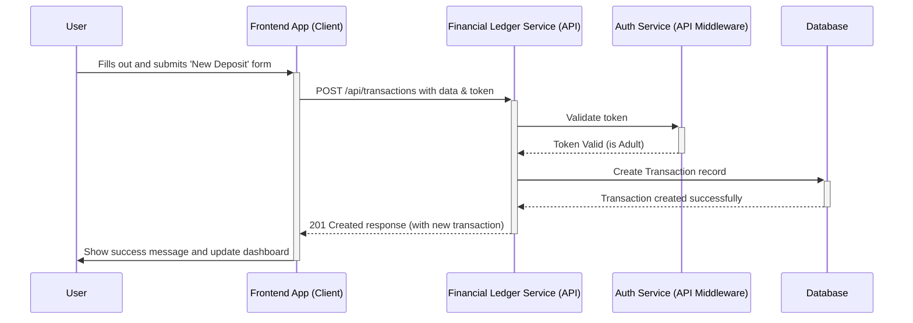

# Saveling Fullstack Architecture Document

## Section 1: Introduction

This document outlines the complete fullstack architecture for Saveling, including backend systems, frontend implementation, and their integration. It serves as the single source of truth for AI-driven development, ensuring consistency across the entire technology stack. This unified approach streamlines the development process for modern fullstack applications where backend and frontend concerns are increasingly intertwined.

**Starter Template or Existing Project**
The project will be built using the **Next.js** framework as its foundation. This provides a production-grade React framework that includes a file-based router, server-side rendering capabilities, and integrated serverless API routes, aligning perfectly with all of our technical assumptions.

**Change Log**
| Date | Version | Description | Author |
| :--- | :--- | :--- | :--- |
| 2025-08-14 | 0.1 | Initial Architecture Draft | Winston (Architect) |

---

## Section 2: High-Level Architecture

**Technical Summary**
The Saveling architecture will be a modern, full-stack application built on the **Next.js** framework. It will leverage a **Monorepo** structure for code organization and a **Serverless** deployment model, utilizing Next.js's integrated API routes for the backend. This approach ensures a tightly integrated, type-safe codebase, rapid development, and a cost-effective, scalable infrastructure from day one.

**Platform and Infrastructure Choice**
* **Platform:** **Vercel**. As the creator of Next.js, Vercel provides the most seamless development and deployment experience. It offers zero-configuration support for our serverless API, a global CDN for performance, and automated CI/CD straight from our repository.
* **Key Services:** Vercel Hosting (for the app), Vercel Functions (for the API), and an external SQL database provider.
* **Database Selection Criteria:** The final database choice will be a serverless-compatible SQL provider (e.g., PlanetScale, Neon). The key selection criteria are: a generous free tier, seamless integration with Vercel, and excellent TypeScript support (e.g., via Prisma or Drizzle ORM).

**Repository Structure**
* **Structure:** **Monorepo**. This is the confirmed approach, allowing us to easily share code and types between the frontend and backend.
* **Monorepo Tool:** We will use the built-in workspace functionality of **pnpm**.
* **Package Organization:** The repository will contain an `apps/web` directory for the Next.js application and a `packages/` directory for shared code, including `packages/db` (for database schema and queries) and `packages/shared-types`.

**High Level Architecture Diagram**
```mermaid
graph TD
    subgraph "User's Device"
        A[Browser]
    end

    subgraph "Vercel Platform"
        B[Global Edge Network / CDN]
        C[Next.js Frontend (React)]
        D[Next.js API Routes (Serverless)]
    end

    subgraph "External Services"
        E[Database (e.g., PlanetScale)]
        G[Auth Provider (e.g., NextAuth.js)]
    end

    A -- HTTPS --> B
    B -- Serves App --> C
    C -- Renders UI --> A
    C -- Fetches Data From --> D
    D -- Authenticates/Authorizes via --> G
    D -- Reads/Writes --> E
```

**Architectural Patterns**

* **Server-Side Rendering (SSR):** We will leverage Next.js's SSR for dynamic pages like dashboards to ensure they are fast and up-to-date.
* **API Routes:** All backend logic for Phase 1 will be implemented as serverless functions within the `pages/api` directory of our Next.js application.
* **Component-Based UI:** The frontend will be built using reusable React components.
* **Utility-First Styling:** We will use a utility-first CSS framework, **Tailwind CSS**, for all styling.

**Conscious Trade-offs**
The decision to implement the backend using integrated Next.js API Routes is a conscious trade-off. We are prioritizing maximum development speed for our initial launch. The primary risk is that the API is not a standalone service, which could complicate the future development of other clients (e.g., a native mobile app).

* **Mitigation:** All core business logic within the API routes will be kept separate from the Next.js request/response handlers, allowing for easier extraction into a standalone service in the future.

---

## Section 3: Tech Stack

This section is the definitive list of technologies we will use.

| Category | Technology | Version | Purpose |
| :--- | :--- | :--- | :--- |
| **Frontend Language** | TypeScript | 5.x | For type safety and maintainability. |
| **Frontend Framework** | Next.js | 14.x | Production-grade React framework. |
| **UI Component Library** | Shadcn/ui | Latest | Accessible, composable UI components. |
| **State Management** | Zustand | 4.x | Simple, lightweight state management. |
| **Backend Language** | TypeScript | 5.x | Language consistency across the stack. |
| **Backend Framework** | Next.js API Routes | 14.x | Integrated serverless backend. |
| **API Style**| REST | N/A | Simple, well-understood API paradigm. |
| **Database ORM** | Prisma | 5.x | Next-generation ORM for TypeScript. |
| **Database Provider** | PlanetScale | N/A | Serverless SQL database platform. |
| **Authentication** | NextAuth.js (Auth.js) | 5.x | Flexible authentication for Next.js. |
| **Testing** | Jest & RTL | Latest | Unit & component testing framework. |
| **Styling** | Tailwind CSS | 3.x | Utility-first CSS framework. |
| **CI/CD** | Vercel | N/A | Automated builds and deployments. |
| **Monitoring/Logging** | Vercel | N/A | Integrated platform analytics and logs. |

---

## Section 4: Data Models

**A Note on IDs:** All primary key `id` fields will be **UUIDs**, automatically generated by the database upon record creation.

**A Note on Currency:** All currency amounts will be stored as integers in **cents** to avoid floating-point math errors.

**Model: Family**

* **Purpose:** The top-level account containing all users and data for a single family.
* **Relationships:** Has many Users.
* **TypeScript Interface:**
  ```typescript
  interface Family {
    id: string;
    handle: string; // The unique login handle
    displayName: string; // The friendly display name
  }
  ```

**Model: User (Profile)**

* **Purpose:** An individual family member. The `type` property will control permissions.
* **Relationships:** Linked to Buckets via BucketMembership.
* **TypeScript Interface:**
  ```typescript
  interface User {
    id: string;
    familyId: string;
    name: string;
    type: 'ADULT' | 'CHILD';
  }
  ```

**Model: Bucket**

* **Purpose:** A container for funds, tied to a specific purpose (e.g., 'Spend').
* **Relationships:** Linked to Users via BucketMembership. Has many Transactions.
* **TypeScript Interface:**
  ```typescript
  interface Bucket {
    id: string;
    name: string;
    iconId: string; // Reference to a curated icon
    balance: number; // A calculated value, in cents
  }
  ```

**Model: Transaction**

* **Purpose:** A record of a single financial event against a specific bucket.
* **Relationships:** Belongs to one Bucket.
* **TypeScript Interface:**
  ```typescript
  interface Transaction {
    id: string;
    bucketId: string;
    type: 'DEPOSIT' | 'WITHDRAWAL';
    amount: number; // Stored in cents
    date: string; // ISO 8601 format
    note?: string;
  }
  ```

---

## Section 5: API Specification

This section outlines the structure of our REST API using the OpenAPI 3.0 specification format.

```yaml
openapi: 3.0.0
info:
  title: Saveling API
  version: 1.0.0
paths:
  /api/family:
    post:
      summary: Create a new Family account
  /api/auth/login:
    post:
      summary: Log in to a Family account
  /api/profiles:
    get:
      summary: Get all profiles for the logged-in family
    post:
      summary: Create a new user profile
  /api/profiles/{profileId}:
    put:
      summary: Update a profile
    delete:
      summary: Delete a profile (soft-delete)
  /api/buckets:
    post:
      summary: Create a new bucket for a user
  /api/buckets/{bucketId}:
    put:
      summary: Update a bucket (e.g., rename, change icon)
    delete:
      summary: Delete a bucket
  /api/dashboard:
    get:
      summary: Get all data needed for the user's dashboard view
  /api/transactions:
    post:
      summary: Create a new transaction (deposit or withdrawal)
```

---

## Section 6: Components

* **1. Authentication Service (Backend):** Manages family account creation, session management, and securing all API endpoints.
* **2. Profile Management Service (Backend):** Handles all CRUD operations for user profiles.
* **3. Financial Ledger Service (Backend):** Manages Buckets and Transactions, handling all financial calculations and rules.
* **4. Dashboard Service (Backend):** A read-only service that aggregates data for the frontend dashboards.
* **5. Frontend Application (Client):** Renders the entire user interface and communicates with all backend API services.

---

## Section 7: External APIs

For our Phase 1 MVP, there are **no required integrations with external, third-party data APIs**.

---

## Section 8: Core Workflows

**Workflow Example: Adult Logs a New Deposit**



---

## Section 9: Database Schema

This schema is written in the Prisma Schema Language.

```prisma
datasource db {
  provider = "mysql"
  url      = env("DATABASE_URL")
}
generator client {
  provider = "prisma-client-js"
}

enum UserType { ADULT CHILD }
enum TransactionType { DEPOSIT WITHDRAWAL }

model Family {
  id           String @id @default(uuid())
  handle       String @unique
  displayName  String
  passwordHash String
  users        User[]
  createdAt    DateTime @default(now())
  updatedAt    DateTime @updatedAt
}

model User {
  id                String   @id @default(uuid())
  name              String
  type              UserType
  familyId          String
  family            Family   @relation(fields: [familyId], references: [id], onDelete: Cascade)
  deletedAt         DateTime?
  bucketMemberships BucketMembership[]
  createdAt         DateTime @default(now())
  updatedAt         DateTime @updatedAt
}

model BucketMembership {
  userId   String
  user     User   @relation(fields: [userId], references: [id], onDelete: Cascade)
  bucketId String
  bucket   Bucket @relation(fields: [bucketId], references: [id], onDelete: Cascade)
  @@id([userId, bucketId])
}

model Bucket {
  id           String @id @default(uuid())
  name         String
  iconId       String
  memberships  BucketMembership[]
  transactions Transaction[]
  createdAt    DateTime @default(now())
  updatedAt    DateTime @updatedAt
}

model Transaction {
  id        String          @id @default(uuid())
  type      TransactionType
  amount    Int
  date      DateTime
  note      String?
  bucketId  String
  bucket    Bucket          @relation(fields: [bucketId], references: [id], onDelete: Cascade)
  createdAt DateTime @default(now())
  @@index([bucketId, date])
}
```

---

## Section 10: Frontend Architecture

* **Component Organization:** A feature-based folder structure will be used. Core UI elements in `components/ui`, and feature-specific components co-located (e.g., `features/dashboard/components`).
* **State Management:** **Zustand** will be used for simple, feature-based state stores.
* **Routing:** The **Next.js App Router** will manage all application routes via the file system.
* **Services Layer:** A centralized API client will abstract all `fetch` calls into service functions (e.g., `transaction.service.ts`).

---

## Section 11: Backend Architecture

* **Service Organization:** Backend logic is defined by the file structure in `pages/api`. Business logic will be abstracted into service files (e.g., `services/profile.service.ts`).
* **Data Access Layer:** API routes will not interact with Prisma directly. They will call service functions which then interact with the database, centralizing all data logic.
* **Authentication:** **NextAuth.js** will handle the login flow and secure API routes by validating the session on every request.

---

## Section 12: Unified Project Structure

```
moolah-vault/
├── apps/
│   └── web/                      # The Next.js application
│       ├── app/                  # App Router pages and API routes
│       ├── components/           # React components
│       └── services/             # Backend business logic
├── packages/
│   ├── db/                       # Prisma schema and client
│   ├── shared-types/             # Shared TypeScript interfaces
│   └── ui/                       # Future shared UI components
├── package.json                  # Root package.json with workspaces
└── tsconfig.base.json            # Base TypeScript config
```

---

## Section 13: Development Workflow

This section defines the setup for a new developer.

* **Prerequisites:** Node.js v20+, pnpm, Docker Desktop.
* **Initial Setup:** `pnpm install`, create `.env` file, `docker-compose up -d`, `pnpm --filter db exec prisma migrate dev`.
* **Dev Command:** `pnpm --filter web dev`.
* **Environment Variables:** `DATABASE_URL`, `NEXTAUTH_URL`, `NEXTAUTH_SECRET`.

---

## Section 14: Deployment Architecture

### Platform and CI/CD Pipeline

* **Platform:** Vercel with GitHub integration for Git-based workflow
* **CI/CD Pipeline:** Comprehensive automated pipeline including:
  - Dependency installation with pnpm monorepo support
  - TypeScript compilation and type checking
  - Full testing suite (unit, component, integration)
  - Database migrations with Prisma
  - Next.js production build with optimization
  - Automated health checks and rollback capabilities
* **Environments:** Production (`main` branch), Preview (feature branches), Development (local)
* **Deployment Verification:** Automated health checks for database, API, and authentication
* **Rollback Strategy:** Automatic rollback on health check failures with manual override options

---

## Section 15: Security and Performance

* **Security:** Passwords hashed with `bcrypt`; sessions managed with secure, `httpOnly` cookies via NextAuth.js; all API input validated with Zod.
* **Performance:** Next.js code-splitting, image optimization, and font optimization will be used. Vercel's Edge Network will cache static assets.

---

## Section 16: Testing Strategy

* **Pyramid:** Focus on a large base of Unit Tests, a smaller layer of Integration Tests, and defer End-to-End tests for later phases.
* **Organization:** Tests will be co-located with the source code they are testing (e.g., `Button.test.tsx`).
* **Tools:** Jest and React Testing Library.

---

## Section 17: Coding Standards

* **Critical Rules:** Enforce type sharing from the `packages/shared-types` directory; use the API service layer for all frontend data fetching; do not access the database directly from API routes; use immutable state patterns.
* **Naming Conventions:** Standard conventions (PascalCase for components, camelCase for hooks and services, etc.) will be followed.

---

## Section 18: Error Handling Strategy

* **Strategy:** A unified strategy will be used. The backend will return a standard JSON error payload. The frontend's centralized API client will catch these errors and display user-friendly "toast" notifications.

---

## Section 19: Monitoring and Observability

* **Stack:** We will use Vercel's built-in Analytics and Logs for all frontend and backend monitoring for Phase 1.
* **Key Metrics:** Core Web Vitals, page views, and JavaScript errors on the frontend; API error rates and execution duration on the backend.

---

## Section 20: Architecture Validation Report

* **Final Decision:** ✅ **APPROVED. The architecture is robust and ready for development.**